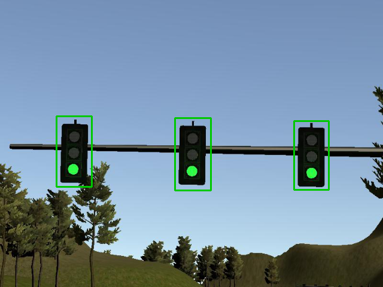
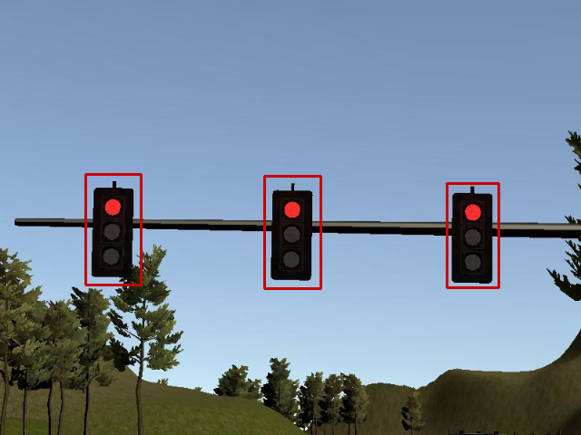
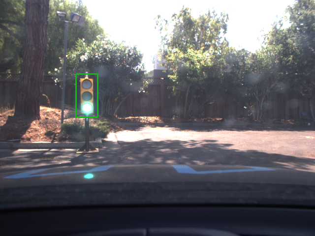
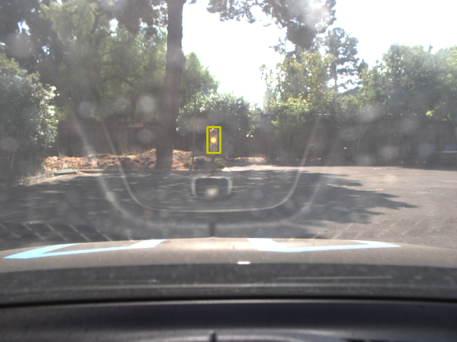
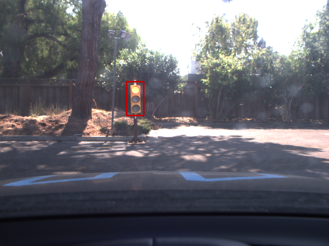
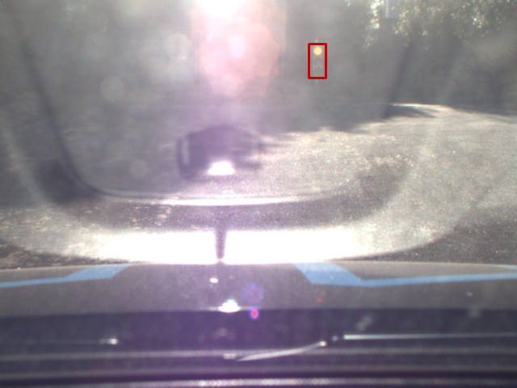

## Udacity Self-Driving Car Nanodegree
## Capstone Project

### Team FormulaSDC
| Name                       | Email                    |
|:---------------------------|:-------------------------|
| Prerit Jaiswal             | prerit.jaiswal@gmail.com |
| Anton Varfolomeev          | dizvara@gmail.com        |
| Kemal Tepe                 | ketepe@gmail.com         |
| Paul Walker                | n43tc3d2rp-u1@yahoo.com  |
| Matthias von dem Knesebeck | mail@knesebeck.com       |

### Overview
Following were the main objectives of this project : 

* Smoothly follow waypoints in the simulator. 
* Respect the target top speed. 
* Stop at traffic lights when needed.
* Stop and restart controllers when DBW is disabled/enabled.
* Publish throttle, steering, and brake commands at 50 Hz.

To achieve these objectives, we implemented a finite state machine consisting of 3 states : (i) `go` state,  (ii) `stop` state, and (iii) `idle` state. In the absence of a traffic light or if the light is green, the state is set to `go` with target speed set to the speed limit while ensuring that the transition from current to target speed is smooth. If a red or yellow traffic light is detected, state is set to `stop` if it is possible to bring the car to halt without exceeding maximum braking. Again, a smooth transition is implemented from current speed to 0. Once the car has come to halt, state is changed to `idle`. The speed in `idle` state is set to zero and the car remains in this state until the light turns green and car goes back to `go` state.  For yaw control, we have used `YawController` already provided while for throttle/braking, we used a proportional controller which takes as input the error in speed. As a final step, low pass filters were applied before publishing the commands to ROS.  

### Traffic Light Detection
The traffic light detection has been realized with the help of OpenCV Cascade Classifier,
based on Viola and Jones (P. Viola and M. J. Jones, “Robust real-time face detection,” International journal of computer vision, vol. 57, no. 2, pp. 137–154, 2004.
) framework. Training samples were collected from simulator and rosbag frames with the addition of images from [Bosch dataset](https://hci.iwr.uni-heidelberg.de/node/6132).
For data augmentation and cascade classifier training custom OpenCV modification by one of the authors was used (https://github.com/diz-vara/opencv).
Once a traffic light has been identified, the bounding box is scaled to a 16x32 pixel image. 

This image is then supplied to a color detection neural network that was trained with numerous examples 
from the labeled Bosch Traffic Light Dataset as well as samples from the Udacity simulation track and provided rosbags. 
This network returns the color with the highest resulting probability identified. 
The Traffic Light Detector then publishes the traffic light waypoint once at least 3 consecutive frames have been 
identified with the same signal.

### Results 

Car was able to successfully complete track lap while meeting all the objectives. Here is a video demonstration on simulator track: 

The results are presented in the following image samples from the simulator track. The bounding boxes show the detected colors:

#### Detection Result for "Green" Traffic Light 

#### Detection Result for "Yellow" Traffic Light 

#### Detection Result for "Red" Traffic Light 

Detection works with real camera images (from the rosbag provided by Udacity),

#### Detection Results for rosbag recordings 
 
 
 

 even in harsh lighting conditions:

 

